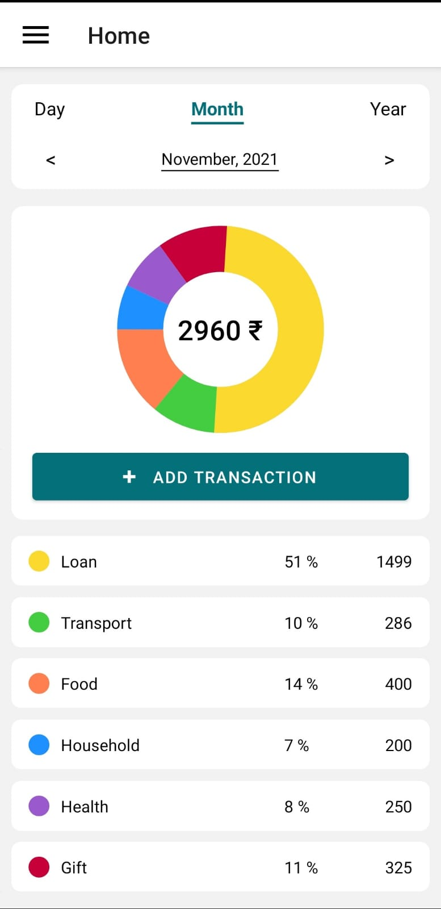
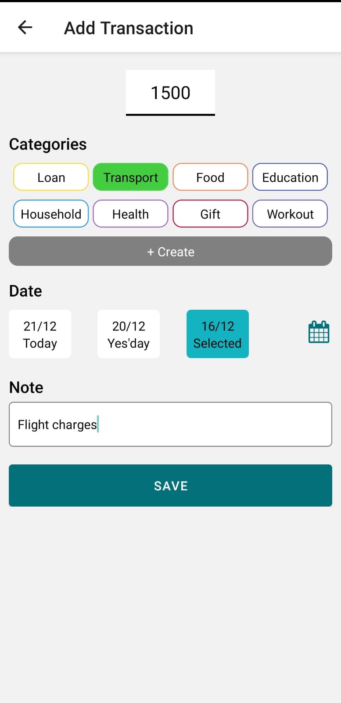
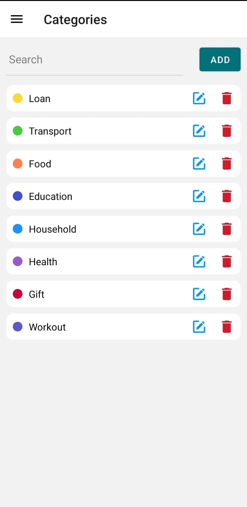
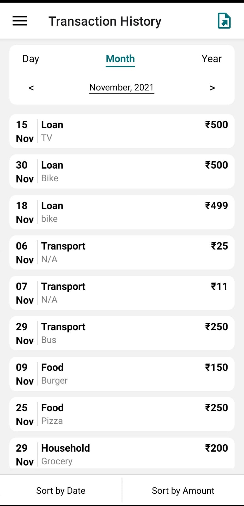

# Expense Tracker

A simple mobile application built with the intention of providing a clean, responsive and attractive UI for entering and managing expenses.

|                              Home                               |                             Add Expense                             |                           Categories                           |                             History                              |
| :-------------------------------------------------------------: | :-----------------------------------------------------------------: | :------------------------------------------------------------: | :--------------------------------------------------------------: |
|  |  |  |  |

## Download APK

Click [here](https://drive.google.com/uc?id=1bPamh3ypL3-X463aTMXCn8XNQdBWaAdZ&export=download) to download the apk file and install to directly use the app for testing.

## Run Locally

Clone the project

```bash
  git clone https://github.com/arsan13/expense-tracker-app.git
```

Go to the project directory

```bash
  cd expense-tracker-app
```

Optional

```bash
Create a local.properties file with sdk location in the android folder if needed.
```

Install dependencies

```bash
  npm install
```

Start Metro

```bash
  npx react-native start
```

Start the application

```bash
  npx react-native run-android
```

## Generate APK

Go to the root of the project in the terminal and run the below command

```bash
  npx react-native bundle --platform android --dev false --entry-file index.js --bundle-output android/app/src/main/assets/index.android.bundle --assets-dest android/app/src/main/res
```

Go to the android directory

```bash
  cd android
```

In the android folder, run the following command

```bash
  ./gradlew assembleDebug
```

The APK file will be present in the following path

```bash
  yourProject/android/app/build/outputs/apk/debug/app-debug.apk
```
